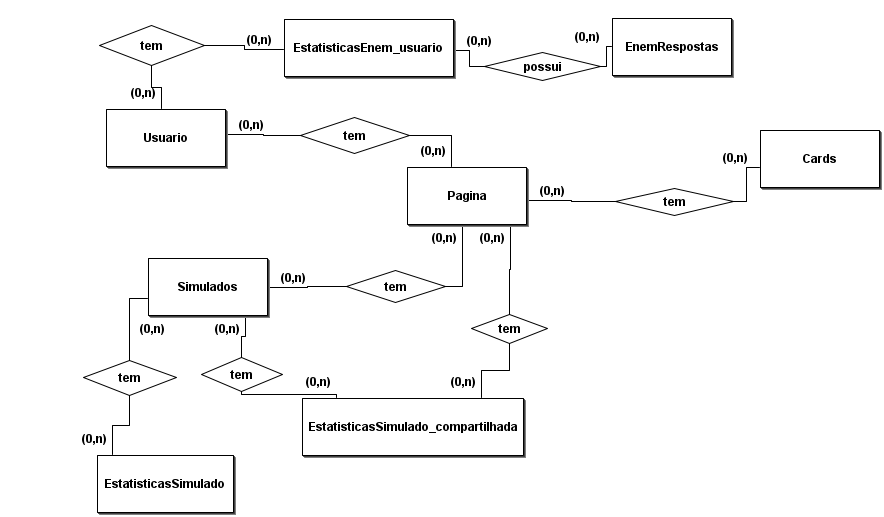
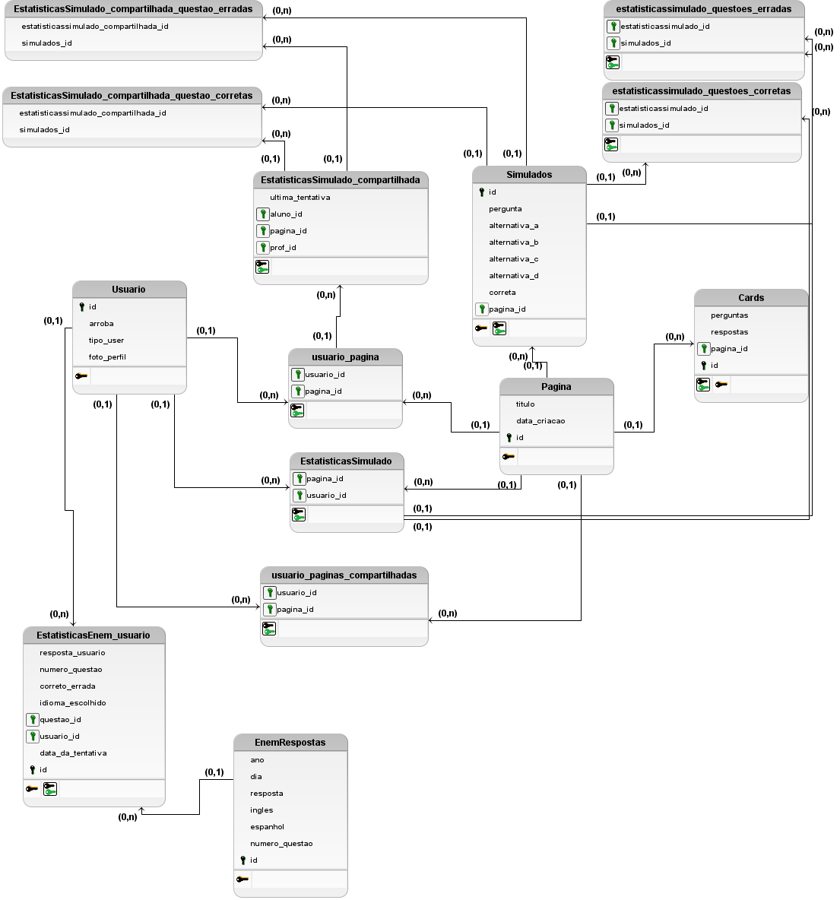

# Documentação

# Guia para Contribuir com o Projeto
Este guia destina-se a desenvolvedores interessados em contribuir com o projeto. Aqui estão algumas diretrizes e instruções para facilitar sua colaboração.

## Como Contribuir

**Crie um ambiente virtual**

 ```shell
    python -m venv nome_do_venv
    .\nome_do_venv\Scripts\activate
```
**Baixe os pacotes para o funcionamento do codigo**
```shell
    pip install django
    pip install pillow
    pip install genai
    pip install google-generativeai
```
**Faça um clone da aplicação**

```shell
    git clone https://github.com/AlanBMC/projeto-integrador-2024-1-CARDY.git
    git checkout -b nome-da-sua-branch
    git add .
    git commit -m "Breve descrição das alterações"
    git remote add upstream https://github.com/AlanBMC/projeto-integrador-2024-1-CARDY.git
    git push origin nome-da-sua-branch
 ```


 ## Funções
 Todas as funções tem uma docstring para facilidar o uso dos proximos desenvolvedores.
```python
def cadastro(request):
def home(request):
def login_user(request):
def logout_view(request):
def paginas(request, pagina_id):
def add_pagina_card(request):
def add_cards(request):
def edit_cards(request):
def delete_card(request):
def simulado(request, simulado_id):
def add_pagina_simulado(request):
def questao_simulado(request):
def edit_questao(request):
def delete_questao(request):
def checa_resposta_simulado(request):
def enem(request, enem_d):
def resposta_enem(request):
def verifica_resposta(request, resposta_usuario, ano, dia, idioma):
def processa_dados_enem(request, enem_dia_ano):
def processar_dados_enem_para_grafico_dois(usuario, ano, dia):
def configurar(request):
def edit_paginas_conf(request):
def edit_titulo_pg(request):
def delete_pg(request):
def estatisticas_simulado(request):
def estatisticas_conteudo(request):
def sol(request):
def genai_configurar():
def obter_e_traduzir_perguntas(dificuldade, categoria, id_pagina):
def traduzir_texto(model, texto):
def salvar_pergunta_resposta_na_pagina(id_pagina, texto_traduzido):
def add_alunos(request):
def paginas_compartilhadas_cards(request, pagina_compartilhada_id):
def paginas_compartilhadas_simulados(request, pagina_compartilhada_id):
def checa_resposta_simulado_prof(request):
def estatisticas_prof(request):
def processa_dados_estatisticas_prof(request):
def processa_dados_estatisticas(request):
def conteudo_geral(request, id_pagina):
def conteudo_geral_enem(request, id_pagina):
def conteudo_geral2(request, id_pagina):
```
## Modelagem de banco de dados

Coloque aqui a modelagem do banco de dados desenvolvido no projeto. Você pode colocar diagramas conceituais e lógicos, ou até mesmo descrever textualmente o que cada uma das tabelas e atributos representam.


### Modelo conceitual
|  |  |
|:-------------:|:------------------------------------------------------------:|
|  </br> **Modelagem conceitual** | A modelagem conceitual é um pré-modelo do projeto, uma visualização em 2D do projeto como um todo. |


### Modelo logico
|  |  |
|:-------------:|:------------------------------------------------------------:|
|  </br> **Modelagem logico** | A modelagem logica é util para criação do sql e verificar a correspondencia de chaves estrangeiras. |

# GUIA BASICO DE NAVEGAÇÃO - desenvolvedor
```python
    path('', views.home, name='home'),
    path('cadastro/', views.cadastro, name='cadastro'),
    path('login/', views.login_user, name='login'),
    path('logout/', views.logout_view, name='logout'),

    # paginas
    path('paginas/<int:pagina_id>', views.paginas, name='paginas'),

    # cards
    path('pagina_card_add/', views.add_pagina_card, name='add_pagina_card'),
    path('add_cards/', views.add_cards, name='add_cards'),
    path('edit_cards/', views.edit_cards, name='edit_cards'),
    path('delete_card/', views.delete_card, name='delete_card'),

    # simulado
    path('simulado/<int:simulado_id>', views.simulado, name='simulado'),
    path('add_pagina_simulado/', views.add_pagina_simulado,
         name='add_pagina_simulado'),
    path('add_questoes_simulado/', views.questao_simulado, name='questao_simulado'),
    path('edit_questao/', views.edit_questao, name='edit_questao'),
    path('delete_questao/', views.delete_questao, name='delete_questao'),
    path('checa_resposta_simulado/', views.checa_resposta_simulado,
         name='checa_resposta_simulado'),
    path('sol/', views.sol, name='sol'),

    path('enem/<int:enem_d>', views.enem, name='enem'),
    path('resposta_enem/', views.resposta_enem, name='resposta_enem'),
    path('processa_dados_enem/<int:enem_dia_ano>', views.processa_dados_enem, name='processa_dados_enem'),

    #configurar
    path('configurar/', views.configurar, name='configurar'),
    path('edit_paginas/', views.edit_paginas_conf, name='edit_paginas_conf' ),
    path('delete_pg/', views.delete_pg, name='delete_pg'),
    path('edit_titulo_pg/', views.edit_titulo_pg, name='edit_titulo_pg'),

    #compartilhamento
    path('add_alunos/', views.add_alunos, name='add_alunos'),

    #paginas compartilhadas
    path('paginas_compartilhadas_cards/<int:pagina_compartilhada_id>', views.paginas_compartilhadas_cards, name='paginas_compartilhadas_cards'),
    path('paginas_compartilhadas_simulados/<int:pagina_compartilhada_id>', views.paginas_compartilhadas_simulados, name='paginas_compartilhadas_simulados'),

    #checa respostas das paginas compartilhadas
    path('checa_resposta_simulado_prof/', views.checa_resposta_simulado_prof, name='checa_resposta_simulado_prof'),
    path('estatisticas_prof/', views.estatisticas_prof, name='estatisticas_prof'),
    path('estatisticas_simulado/', views.estatisticas_simulado, name='estatisticas_simulado')
```

## GUIA BASICO DE NAVEGAÇÃO - usuario
*Acessa nossa documentação para usuario* [guia para usuarios](MANUAL.md)
